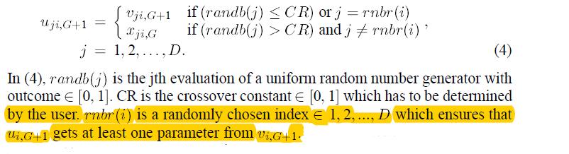

简单差分算法
===============

Storn, R., & Price, K. (1997). Differential evolution–a simple and efficient heuristic for global optimization over continuous spaces. Journal of global optimization, 11(4), 341-359.

### 变异 mutation

在每一次迭代中，以个体为维度进行变异操作，选择不同于当前个体其它 3 个不同个体，使用以下公式进行变异操作。

由公式所知，种群的个体个数必须大于等于 4。同时还需要设置一个超参 F，用于缩放个体差。

### 交叉 crossover

在每一次迭代中，以个体分量为维度进行交叉操作，依次循环个体分量，按以下公式进行交叉操作。

