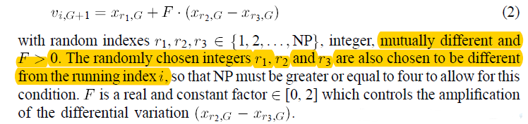
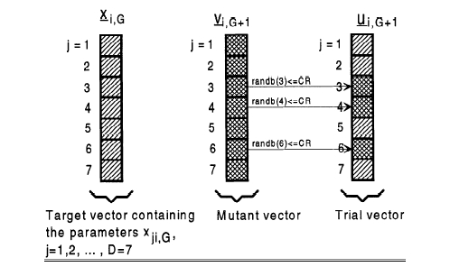

简单差分算法
===============

Storn, R., & Price, K. (1997). Differential evolution–a simple and efficient heuristic for global optimization over continuous spaces. Journal of global optimization, 11(4), 341-359.

### 变异 mutation

在每一次迭代中，以个体为维度进行变异操作，选择不同于当前个体其它 3 个不同个体，使用以下公式进行变异操作。

由公式所知，种群的个体个数必须大于等于 4。同时还需要设置一个超参 F，用于缩放个体差。

### 交叉 crossover

在每一次迭代中，以个体分量为维度进行交叉操作，依次循环个体分量，按以下公式进行交叉操作。

### 结论

简单 DE 算法在每一次的变异操作中，用作用到每一个个体，且参与变异操作的个体需要随机选择 3 个不同的个体。
其中原个体作为参照对象，在交叉操作与选择操作中使用。
选取的 3 个个体用于生成新个体，以其中一个为基，加以另两个个体之差乘以固定系数之后的值。
在变异操作中，变异的操作维度为个体。
在交叉操作中，交叉的操作维度为个体分量。
在选择操作中，以“贪心策略”选择适应值较优的个体。

变异操作与交叉操作的主要作用是用于生成新的比较个体，加强了算法的随机性，而选择操作的“择优选择”加快了算法的收敛速度。