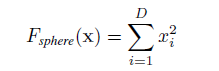
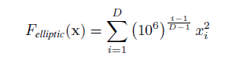
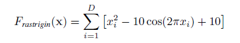

目标函数
====================

the Sphere Function [1]

the Rotated Elliptic Function [1]

Rotated Rastrigin's Function [1]

### 参考

1. Tang, K., Yao, X., Suganthan, P. N., MacNish, C., Chen, Y. P., Chen, C. M., & Yang, Z. (2010). Benchmark Functions for the CEC 2010 Special Session and Competition on Large Scale Global Optimization. University of Science and Technology of China (USTC), School of Computer Science and Technology, Nature Inspired Computation and Applications Laboratory (NICAL), Hefei, Anhui. China. Tech. Rep, Tech. Rep.